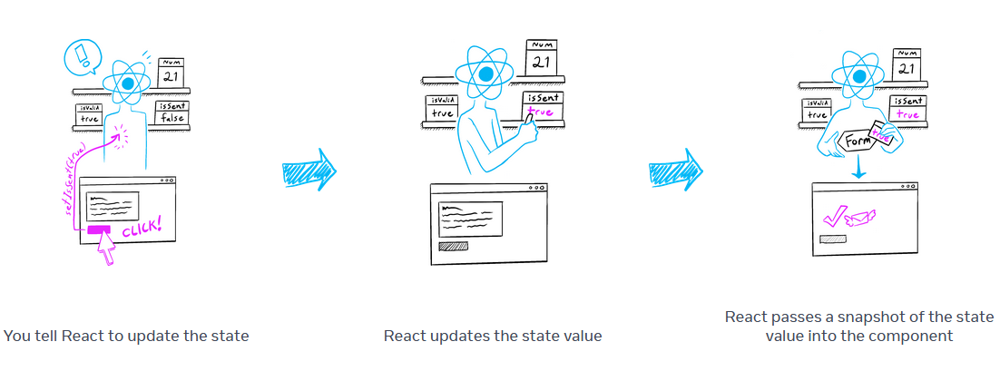

# Curso React 101 - Tracasa
---
## Agenda:  día 1

- [ ] Entorno de desarrollo (IDE, Git, Linters, Typescript)
- [ ] Intro React
- [ ] Hola mundo en React
- [ ] Pensar en modo React
- [ ] Hooks
- [ ] Puertas de escape
- [ ] Aplicando estilo a nuestros componentes

---
## Agenda: día 2

- [ ] Formularios en React
- [ ] Manejo de estado en la aplicación
- [ ] Testeando componentes
- [ ] test unitarios con Jest/vitest + Testing Library
- [ ] Llamando a APIs (Axios / React query)
- [ ] Otros: Librerías React que deberías conocer

---

# DIA 1
---
## 1. Entorno de desarrollo

---
### 1.1. VS Code

[Descarga vscode](https://code.visualstudio.com/)

Plugins que deberías instalarte para desarrollar React

-  [ES7+ React/Redux/React-Native snippets](https://marketplace.visualstudio.com/items?itemName=dsznajder.es7-react-js-snippets)
-  [Eslint](https://marketplace.visualstudio.com/items?itemName=dbaeumer.vscode-eslint)
-  [Vitest](https://marketplace.visualstudio.com/items?itemName=vitest.explorer)


-  [Axe Accessibility Linter](https://marketplace.visualstudio.com/items?itemName=deque-systems.vscode-axe-linter)

Atajos de teclado que deberías memorizar:

- [ctrl]+[p]
- [ctrl]+[shift]+[p]

---
### 1.2. Git básico 

 [Descarga Git](https://git-scm.com/)

- [Fundamentos de Git](https://git-scm.com/book/es/v2)
- [Git cheatsheet](https://training.github.com/downloads/es_ES/github-git-cheat-sheet/)
- En un proyecto React
  - Gitignore
  - package-lock.json?

- Flujos de trabajo de git:
  - [Gitflow](https://www.atlassian.com/es/git/tutorials/comparing-workflows/gitflow-workflow)
  - [Github flow](https://docs.github.com/en/get-started/using-github/github-flow) (mi preferido)

---
#### 1.2.1. conventional commits

[¿Qué es conventional commits?](https://www.conventionalcommits.org/es/v1.0.0/)

---
### 1.3. TypeScript

> Javascript es tan flexible que está roto... Typescript lo arregla

- [Typescript](https://www.typescriptlang.org/)
- [Typescript cheatsheets](https://www.typescriptlang.org/cheatsheets/)

---
**Typescript: interfaces vs types**

> En general, puedes usar interface hasta que te sea necesario utilizar características de type.

---
**Typescript: interfaces vs types**

**Usa `interface` cuando**:

- Necesitas que la estructura sea extendible (herencia).
- Quieres que las declaraciones se puedan combinar automáticamente.

---
**Typescript: interfaces vs types**

**Usa `type` cuando**:

- Necesitas definir un alias para un tipo más complejo que solo la forma de un objeto.
- Requieres utilizar uniones o intersecciones de tipos.
- Necesitas definir tipos que no se pueden hacer con `interface` (como tipos primitivos).

[mas detalle](https://matiashernandez.dev/blog/post/types-vs-interfaces-cuando-utilizar-cada-una)

---
### 1.4. Herramientas de debug de React

- [React Developer Tools](https://react.dev/learn/react-developer-tools)
- Configurando VSCode para desarrollar/debuggear en React

---
### 1.5. Estructura de un proyecto Javascript moderno

- un vistazo al package.json

---
### 1.5.1. Generadores

```bash
npm init react-app hola-mundo-app --template typescript
```
o
```bash
npm init vite
```

---
### 1.5.2. Linters

- [Eslint](https://eslint.org/)
- [Prettier](https://prettier.io/)
- [Commitlint](https://commitlint.js.org/)

Buena práctica: instalar [Husky](https://typicode.github.io/husky/) para asegurarnos de hacemos commits con los linters pasados

---
## 2. Introducción a React

---
### 2.1. Estructura de un proyecto de React

- [Documentación oficial de react](https://react.dev/learn)

---
#### 2.1.1. formas de arrancar react

- Entendiendo el punto de entrada
- Modos de ejecución (dev y build)

- [Frameworks react](https://react.dev/learn/start-a-new-react-project)

---
### 2.2. Hola mundo en React

[https://github.com/francho-plain/react-101-tracasa](https://github.com/francho-plain/react-101-tracasa)

---
#### 2.2.1. Anatomía de un componente React

- Ficheros JSX
- Intefaces de llamada
- Nuestra UI es un árbol

⚒️ Vamos a crear nuestro primer componente reutilizable: TaskCard

---
#### 2.2.2. Pintando cosas por pantalla

- {}
- <>
- condicionales
- listas

📖 [Describing the UI](https://react.dev/learn/describing-the-ui)

---
### 2.3. "Pensar en modo React"

> piensa en componentes atómicos e intercambiables

📖 [Thinking in react](https://react.dev/learn/thinking-in-react)

---
#### 2.3.1. Pensar en componentes

1. Descomponer la Interfaz
2. Crear render estático
3. Identificar estado
4. Definir flujo de datos unidireccional
5. Interactividad y eventos
6. Llamadas a APIs y efectos secundarios
7. Optimización del Rendimiento

---
**PASO 1. Descomponer la Interfaz**

- Identificar Componentes
- Árbol de Componentes

---
**PASO 2. Crear Render Estático**

- Componentes sin Estado
- Datos Simulados

---
**PASO 3. Identificar el Estado**

- Qué debe estar en el Estado
- Dónde debe estar el Estado

---
**PASO 4. Flujo de Datos Unidireccional**

- Props de Padres a Hijos
- Callbacks para Actualizar Estado

---
**PASO 5. Interactividad y Eventos**

- Manejo de Eventos
- Actualizar Estado

---
**PASO 6. Llamadas a APIs y Efectos Secundarios**

- useEffect: Llamadas a APIs y suscripciones

---
**PASO 7. Optimización del Rendimiento**

- Evitar Re-renders: React.memo, useMemo, useCallback
- División de Código: React.lazy, Suspense

---
⚒️ TaskList

---
#### 2.3.2. Ciclo de vida de los componentes (interactividad)

- Los componentes base traen callbacks por defecto
- Podemos crear nuestros propios callbacks

⚒️ CompleteTaskButton

---
**Entender el render de React**

- Cualquier actualización de pantalla en una aplicación React ocurre en tres pasos:

1. Desencadenar
2. Renderizar
3. Confirmar

- Puedes usar el Modo Estricto para encontrar errores en tus componentes.
- React no toca el DOM si el resultado de la renderización es el mismo que la última vez.

📖 [Render and Commit](https://react.dev/learn/render-and-commit)

---
#### 2.3.3. Las reglas de React

1. Los componentes y hooks deben ser puros
   - Sólo piensan en su propia lógica
   - Mismas entradas, producen mismas salidas
   - No deben dependender de la secuencia de renderizado de otros
   - No se deben mutar los parámetros de entrada ni estados directamente
2. React llama a los componentes y a los hooks (no tú)
3. Sólo llama a los hooks en el primer nivel y sólo desde componentes funcionales u hooks propios

📖 [Rules of React](https://react.dev/reference/rules)

---
### 2.4. Hooks

Los hooks son una poderosa característica de React que facilita la gestión del estado y otros aspectos en componentes funcionales, mejorando la reutilización y la composición de código

📖 [React Hooks](https://react.dev/reference/react/hooks)

---
#### useState

- `useState` es un hook que permite añadir estado a componentes funcionales en React.

  (Antes de los hooks, solo los componentes de clase podían tener estado.)

- Cuando "seteamos el estado" se solicita un re-render del componente

- 💡Truco: tratar las variables como de solo lectura (por ejemplo `[...datos, nuevoDato]` en vez de `datos.push(nuevoDato)`)

---


👀 [Ver ejemplo de la documentación](https://react.dev/learn/state-as-a-snapshot)


📖 [doc useEffect](https://react.dev/reference/react/useEffect)

---
#### useCallback

- useCallback es un hook que devuelve una versión memorizada de una función callback.
- Utilizado para optimizar el rendimiento al evitar la recreación de funciones en cada renderizado.

📖 [doc useCallback](https://react.dev/reference/react/useCallback)

---
#### useMemo

- permite cachear el resultado de un cálculo entre re-renderizados

📖 [doc useMemo](https://react.dev/reference/react/useMemo)


### 2.5. Puertas de escape

- A veces es necesario controlar o sincronizar cosas fuera del ciclo de react (ejemplo, empezar/pausar un video, modificar el dom directamente...)
- Existen varios mecanismos

---
#### useRef

- se usa cuando quieres recordar alguna información, pero no quieres forzar un nuevo renderizado
- si la referencia cambia no se fuerza el re-renderizado

📖[doc useRef](https://react.dev/reference/react/useRef)

---
#### useEffect
- useEffect es un hook que permite realizar efectos secundarios en componentes funcionales de React.
- Efectos secundarios pueden incluir: suscripción a datos, cambios en el DOM, peticiones HTTP, etc.
- Se ejecuta después del renderizado, permitiendo sincronizar el componente con recursos externos.
- > useEffect retrasa un trozo de codigo y lo ejecuta cuando el render ha sido reflejado en pantalla

📖[Synchronizing with effects](https://react.dev/learn/synchronizing-with-effects)
📖[doc useEffect](https://react.dev/reference/react/useEffect)

#### hooks propios

- siempre empiezan por `use`
- pueden usar otros hooks dentro de ellos
- permiten reutilizar logica (no estado en si)
- componentes más limpios

📖[reusing login with custom hooks](https://react.dev/learn/reusing-logic-with-custom-hooks)

---
## 2.6. Aplicando estilo a nuestros componentes

- `className` en vez de `class`
- Hay varias formas de gestionar las hojas de estilo
  -  Styled components, Tailwind CSS, estilo js global...
- Nosotros vamos a usar:
  - [CSS modules](https://github.com/css-modules/css-modules)
  - variables CSS


---

DIA 2
--

---

2.7. Formularios en React

2.8. Manejo de estado en la aplicación

2.8.1. React Context + useReducer*

2.8.2. Otros* (solo Zustand) NO ---> Redux

2.9. Testeando componentes

2.10. test unitarios con Jest + Testing Library

NO --> 2.10.1. Otros* (test de integracion con Playwright)

2.11. Llamando a APIs (React query + Axios)

3. Otros*: Librerías React que deberías conocer

3.1. react-router

3.2. react-i18next

3.3. react-hook-form

3.4. react-query (Se ve en el punto anterior)

3.5. helmet


(*) Estas partes se verán muy por encima (sin entrar en detalle ni desarrollar código), simplemente están pensadas para que los alumnos conozcan de su existencia y puedan profundizar por su cuenta si lo desean)

Requisitos

- Curso presencial.

- Junio (fecha por concretar)

- Los alumnos deberán disponer de un ordenador con conexión a internet y con el siguiente software ya instalado: o Visual Studio Code (https://code.visualstudio.com/) o Última versión de node LTS (https://nodejs.org/) o Git (https://git-scm.com/)

- Recomendado pero no obligatorio tener una cuenta de Github creada

Organización de tiempo:

- Dia 1: del punto 1 al 2.6

- Dia 2: del 2.7 al 3.5